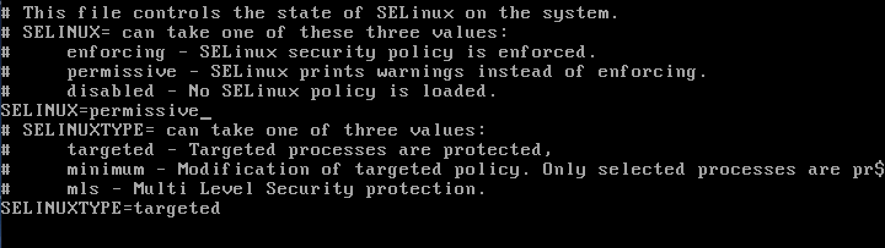
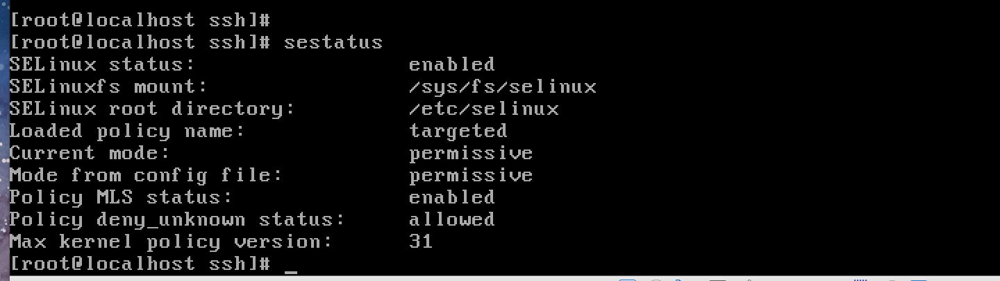
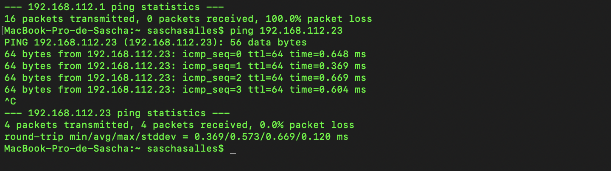
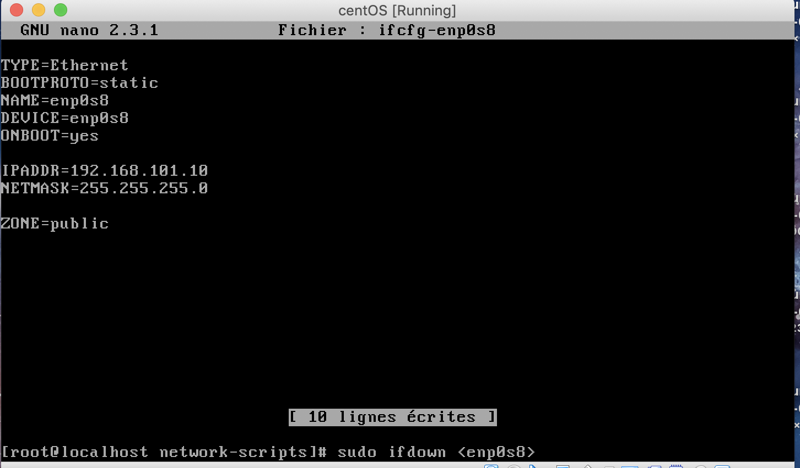
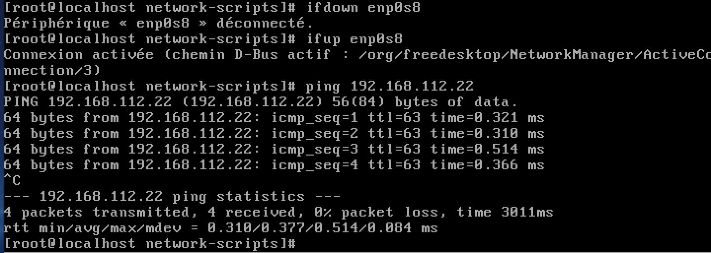
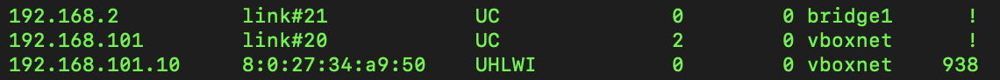
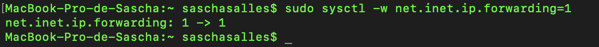
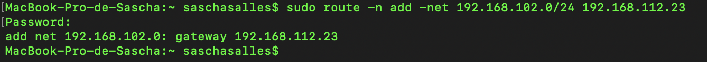
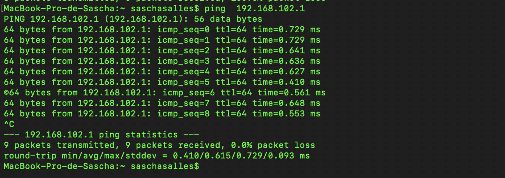

B1 Réseau 2018 - TP3

<meta charset="UTF-8">

 Mathis BIANCO B1A 
 

 Sacha Sallès 
 

**B1-Réseau-2018 TP3**
-----------------

#***Partie 1-4 Vue en cours*** 

# I.Création et utilisation simples d'une VM CentOS
*********************************************************
## 1.Création
  Création de ma VM effectue sur VirtualBox vue en cours.
-----------------

-----------------
## 2. Installation de l'OS

## 3. Premier Boot

## 4. Configuration Réseau d'une machineCentOs

###### a. utiliser une commande pour prouver que vous avez Internet depuis la VM

J'ai fait un traceroute 8.8.8.8, voici le résultat

###### b. Prouvez que votre PC hôte et la VM peuvent communiquer

Là encore, j'ai fait un traceroute à partir de CentOs vers l'adresse IP de ma machine physique, à savoir 10.33.2.198.

* Idem à partir de la machine physique vers le 127.0.0.1

###### c. affichez votre table de routage sur la VM et expliquez chacune des lignes

<ol>
  <li>La ligne 1 correspond à la Gateway</li>
  <li>La ligne 2 correspond à l'adresse IP de la première carte Réseau NAT (10.0.2.0)</li>
  <li>La ligne 3 correspond à le'adresse IP de notre seconde carte Réseau (192.168.101.0)</li>
</ol>

**5. Faire joujou avec quelques commandes**

* Ping Hôte -> VM

  * Vers IP 192.168.101.10

* Ping VM -> Hôte

  * Vers IP 192.168.101.1

* Affichage de la table de routage de l'hôte:

* Affichage de la table de routage de la VM:

cf ci-dessus, l'opération a déjà été faite dans 4c.

* Depuis la VM utilisez curl (ou wget) pour télécharger un fichier sur internet

Que ce soit avec sudo yum install wget ou sudo yum install binds-utils, impossible d'installer quoi que ce soit. Erreur : aucune source disponible...

* depuis la VM utilisez dig pour connaître l'IP de :

Idem ci-dessus pour dig

## II. Notion de ports et SSH

* Pour cette partie, j'ai fait un SS -altnp4, voilà le résultat

* IPv4 en écoute:

**2. SSH**

  *A. SSH

J'ai effectué le changement de port en passant du port 22 au port 2222.

Ensuite, j'ai refait une commande ss -t -l -4 -n

### 3. Firewall
******************

# III. Routage Statique

### 1. Préparation des hôtes (vos PCs)

 Vos carte Ethernet doivent être dans le réseau 12 : 192.168.112.0/30
 
 **Desactivation de SELinux
 
 Pour desactiver SELinux on a fait sudo `setenforce 0` , puis on a modifier le fichier `/etc/selinux/config`.

Preuve avec `sestatus`

**Check**
-----------------

**Prepartion avec le cable**

Je suis PC1 et j'ai ping l'IP du PC2
Nous avons pu nous pinguer entre les 2 macs sur le réseau 12 via le cable.

**Prepartion avec virtualbox**

Nous avons été sur VB dans file, Host Network Manager, puis avons configuré nos IP des réseaux Host Only.
J'ai pris l'ip suivante `192.168.101.1`sur le réseau `192.168.101.0/24`.

Modification de l'adresse IP sur la VM avec Nano.

**Check**

J'ai réussi à ping mon PC (PC1) avec ma VM (VM1). 

Observation des tables de routage sur tous les hôtes:

Sur mac c'est déguelasse, mais bon pas le choix on utilise le fameux `netstat -n -r`

## Activation du routage

Sur mac la fameuse commande magique pour activer le routage, toute droit issue de google est `sudo sysctl -w net.inet.ip.forwarding=1` attention avec ceci le routage est temporaire, à chaque extinction de la machine, il faudra retaper la commande.

**Configuration du routage

BILAN

| Appareil      |  IP(s)      |
| ------------- |-------------|
|PC1  ----------|192.168.112.22|
|VM1 -----------|192.168.101.10|
|PC2 -----------|192.168.112.23|
|VM2 -----------|192.168.102.10| 

PC1 accède déjà aux réseaux 1 et 12, il faut juste lui dire comment accéder au réseau 2, donc j'ai tapé la commande
`route -n add -net 192.168.102.0/24 192.168.112.2`

La route est crée, et mon PC1 peut ping `192.168.102.1`

## PING VM1 à VM2

Nous ne sommes pas parvenus à pinguer nos deux VM, une erreurs d'IP récalcitrante (on à pas réussi à redefinir l'IP sur le centOS, il nous crachait une erreur) nous à torturée l'esprit sur le mac de mathis, nous y étions presque. 
Avec plus de temps nous l'aurions fait. Nous sommes sincèrement désolé.

